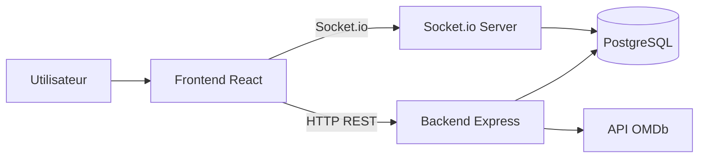

# Architecture - CineConnect

## 1. Vue d'ensemble

L'application suit une architecture client-serveur:

- Frontend React: expérience utilisateur, navigation, affichage
- Backend Express: API REST, authentification JWT, logique métier
- PostgreSQL: persistance des données métier
- Socket.io: communication temps réel pour le chat film

## 2. Diagramme de flux

## 3. Couches backend

- `src/routes/*`: déclaration des endpoints
- `src/controllers/*`: logique métier par domaine
- `src/middlewares/auth.middleware.js`: validation JWT
- `src/db/schema/*`: modèles Drizzle
- `src/sockets/chat.socket.js`: événements chat temps réel
- `src/docs/swagger.js`: génération OpenAPI

## 4. Couches frontend

- `src/routes/__root.jsx`: arbre de routes et protection auth
- `src/pages/*`: pages fonctionnelles
- `src/hooks/*`: hooks de données (React Query)
- `src/contexts/*`: états transverses (auth, favoris, liste)
- `src/services/api.js`: appels backend

## 5. Flux fonctionnels principaux

### Authentification

1. Le frontend envoie `POST /auth/login`.
2. Le backend valide credentials et renvoie un JWT.
3. Le token est stocké côté client dans `localStorage`.
4. Les routes privées envoient `Authorization: Bearer <token>`.

### Consultation et interaction film

1. Le frontend interroge le backend pour la recherche et les détails film.
2. Le backend appelle OMDb si nécessaire, puis persiste les données utiles en base.
3. Les utilisateurs connectés peuvent:
   - publier une review (`POST /reviews`)
  - réagir à une review (`POST /reviews/:id/reaction`)
   - ajouter en favoris (`POST /favorites`)
  - ajouter en liste (`POST /mylists`)

### Chat temps réel

1. Le client se connecte via Socket.io.
2. Il rejoint une room par film (`joinFilm`).
3. Les messages sont diffusés aux utilisateurs de la room.
4. Les messages sont persistés en base.

## 6. Sécurité

- JWT sur endpoints sensibles (profil, reviews write, favoris, mylists, messages)
- Validation des proprietaires sur update/delete (reviews/messages)
- CORS configuré selon `FRONTEND_URL`

## 7. Documentation et observabilité

- Swagger UI disponible sur `GET /docs`
- Logs démarrage serveur avec URL API et docs
