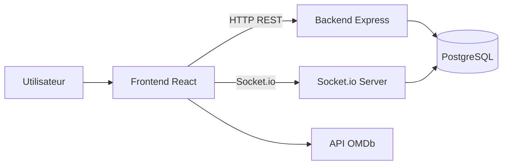

# Architecture - CineConnect

## 1. Vue d'ensemble

L'application suit une architecture client-serveur:

- Frontend React: experience utilisateur, navigation, affichage
- Backend Express: API REST, authentification JWT, logique metier
- PostgreSQL: persistance des donnees metier
- Socket.io: communication temps reel pour le chat film

## 2. Diagramme de flux

## 3. Couches backend

- `src/routes/*`: declaration des endpoints
- `src/controllers/*`: logique metier par domaine
- `src/middlewares/auth.middleware.js`: validation JWT
- `src/db/schema/*`: modeles Drizzle
- `src/sockets/chat.socket.js`: evenements chat temps reel
- `src/docs/swagger.js`: generation OpenAPI

## 4. Couches frontend

- `src/routes/__root.jsx`: arbre de routes et protection auth
- `src/pages/*`: pages fonctionnelles
- `src/hooks/*`: hooks de donnees (React Query)
- `src/contexts/*`: etats transverses (auth, favoris, liste)
- `src/services/api.js`: appels backend

## 5. Flux fonctionnels principaux

### Authentification

1. Le frontend envoie `POST /auth/login`.
2. Le backend valide credentials et renvoie un JWT.
3. Le token est stocke cote client.
4. Les routes privees envoient `Authorization: Bearer <token>`.

### Consultation et interaction film

1. Le frontend recupere des informations film.
2. Les utilisateurs connectes peuvent:
   - publier une review (`POST /reviews`)
   - reagir a une review (`POST /reviews/:id/reaction`)
   - ajouter en favoris (`POST /favorites`)
   - ajouter en liste (`POST /mylists`)

### Chat temps reel

1. Le client se connecte via Socket.io.
2. Il rejoint une room par film (`joinFilm`).
3. Les messages sont diffuses aux utilisateurs de la room.
4. Les messages sont persist es en base.

## 6. Securite

- JWT sur endpoints sensibles (profil, reviews write, favoris, mylists, messages)
- Validation des proprietaires sur update/delete (reviews/messages)
- CORS configure selon `FRONTEND_URL`

## 7. Documentation et observabilite

- Swagger UI disponible sur `GET /docs`
- Logs demarrage serveur avec URL API et docs
