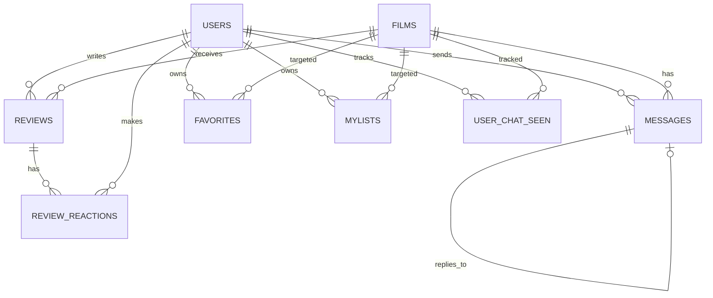

# Schema Base de Donnees - CineConnect

## 1. Tables principales

### users

- `id` (PK)
- `username` (unique)
- `email` (unique)
- `password`
- `display_name`
- `avatar`
- `reset_password_token`
- `reset_password_expires`
- `created_at`

### films

- `id` (PK)
- `imdb_id` (unique)
- `title`
- `poster`
- `year`

### categories

- `id` (PK)
- `name` (unique)

### reviews

- `id` (PK)
- `rating`
- `comment`
- `user_id` (FK -> users.id)
- `film_id` (FK -> films.id)
- `created_at`

### review_reactions

- `id` (PK)
- `review_id` (FK -> reviews.id, cascade delete)
- `user_id` (FK -> users.id)
- `type` (`like` ou `dislike`)
- `created_at`
- contrainte unique (`review_id`, `user_id`, `type`)

### messages

- `id` (PK)
- `content`
- `user_id` (FK -> users.id)
- `film_id` (FK -> films.id)
- `reply_to_id` (FK auto-reference -> messages.id)
- `created_at`
- `deleted_at`

### favorites

- `id` (PK)
- `user_id` (FK -> users.id, cascade delete)
- `film_id` (FK -> films.id, cascade delete)
- `created_at`

### mylists

- `id` (PK)
- `user_id` (FK -> users.id, cascade delete)
- `film_id` (FK -> films.id, cascade delete)
- `created_at`

### user_chat_seen

- `id` (PK)
- `user_id` (FK -> users.id)
- `film_id` (FK -> films.id)
- `last_seen_at`

## 2. Cardinalites

- 1 user -> N reviews
- 1 film -> N reviews
- 1 review -> N reactions
- 1 user -> N reactions
- 1 film -> N messages
- 1 user -> N messages
- N users <-> N films via favorites
- N users <-> N films via mylists
- N users <-> N films via user_chat_seen

## 3. Diagramme relationnel simplifie

## 4. Notes de conception

- Les films sont identifies metierement par `imdb_id`.
- Les tables favorites/mylists jouent le role de tables de liaison user-film.
- Le chat supporte reponse a message (`reply_to_id`) et soft delete (`deleted_at`).
